# 🔐 SmartShield – Real-Time Intrusion Detection System (IDS)

**SmartShield** is a machine learning-based real-time Intrusion Detection System (IDS) that classifies network packets as malicious or normal using supervised learning algorithms. It combines live packet sniffing with a GUI dashboard to alert users in real-time.

---

## 📌 Features

- Real-time packet sniffing using **Scapy**
- ML models: **KNN, Random Forest, SVM, Decision Tree**
- GUI-based dashboard using **Tkinter**
- Real-time alerts with CSV logging
- Threshold-based popups for suspicious activity
- Full model evaluation using **Confusion Matrix, ROC, PR, Learning Curves**

---

## 🧠 Model Evaluation

| Model           | Accuracy (%) | AUC Score |
|----------------|--------------|-----------|
| KNN             | 91.2         | 0.89      |
| Random Forest   | 96.5         | 0.97      |
| SVM             | 93.7         | 0.91      |
| Decision Tree   | 90.1         | 0.88      |

### 🔍 K-Nearest Neighbors (KNN)
- **Confusion Matrix**  
  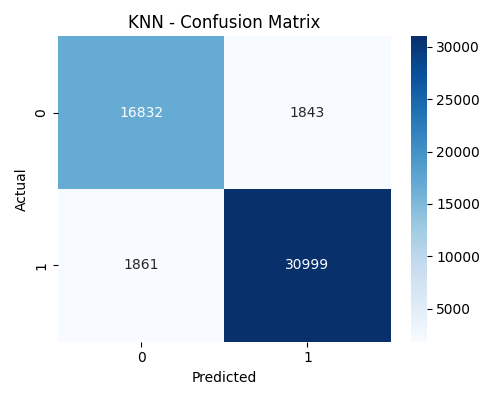
- **ROC Curve**  
  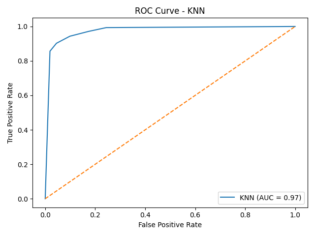
- **PR Curve**  
  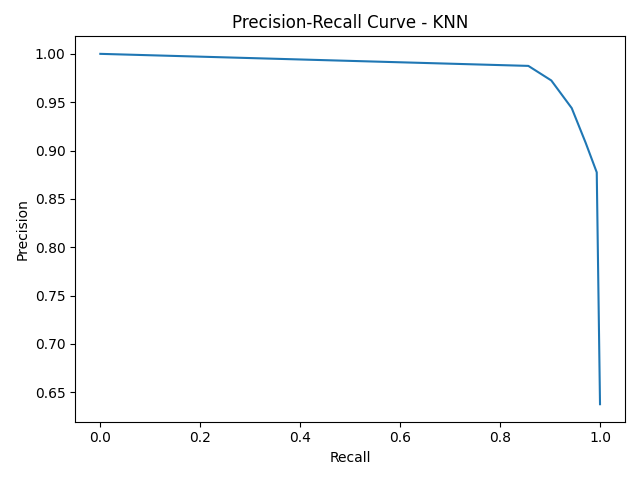

---

### 🌲 Random Forest
- **Confusion Matrix**  
  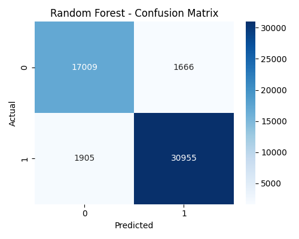
- **ROC Curve**  
  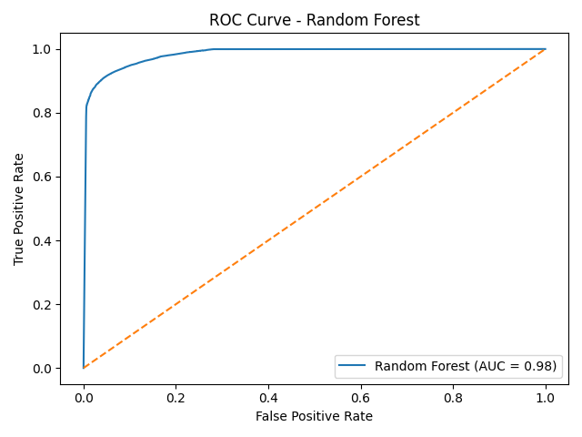
- **PR Curve**  
  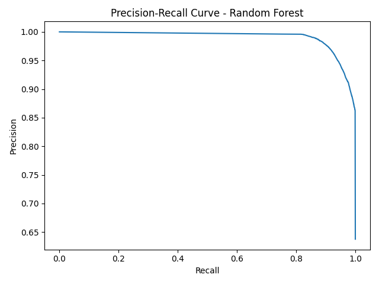
- **Learning Curve**  
  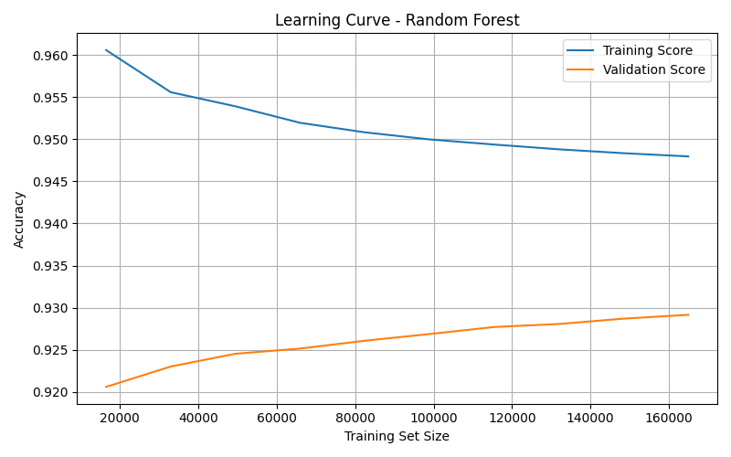

---

### 📈 Support Vector Machine (SVM)
- **Confusion Matrix**  
  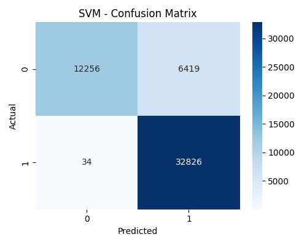
- **ROC Curve**  
  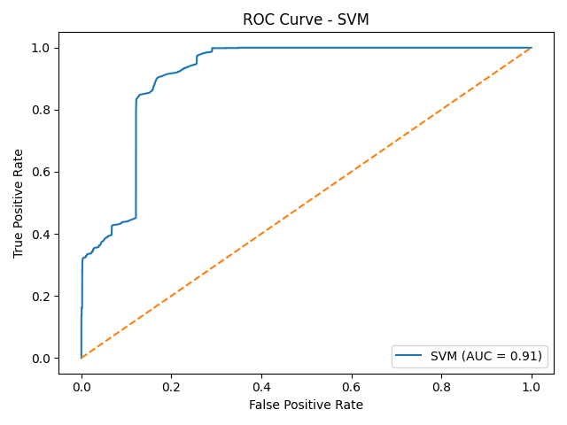
- **PR Curve**  
  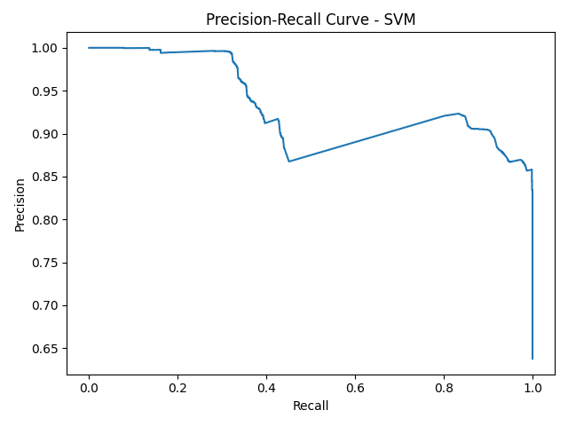

---

### 🌳 Decision Tree
- **Confusion Matrix**  
  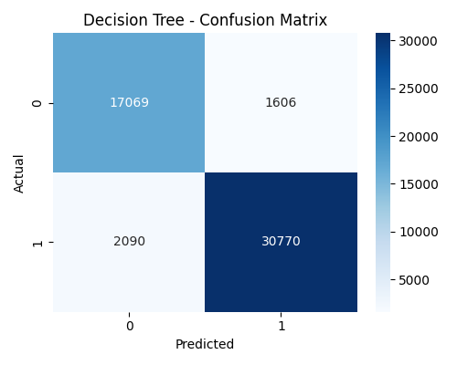
- **ROC Curve**  
  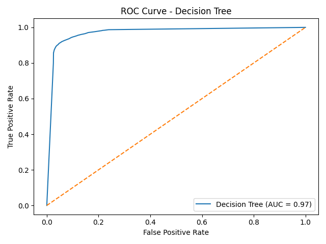
- **PR Curve**  
  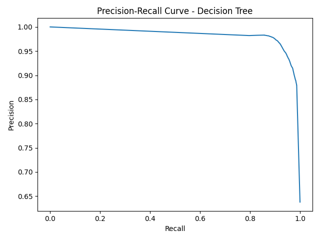

---

## 🖥 GUI Preview

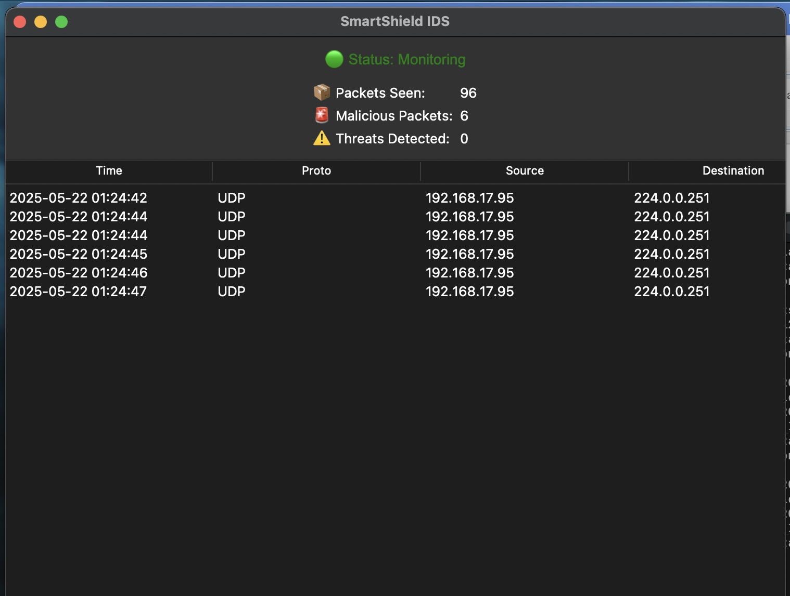

- Live packet monitoring
- Realtime classification with alert banners
- Automatic CSV logging of suspicious packets

---

## 🛠 Tech Stack

- Python 3.x  
- Scikit-learn  
- Scapy  
- Tkinter  
- Joblib  
- Matplotlib / Seaborn

---

## 🧪 Installation

```bash
# Clone the repository
git clone https://github.com/TanishAhuja/SmartShield.git
cd SmartShield

# Install dependencies
pip install -r requirements.txt

# Run the application
python main.py
